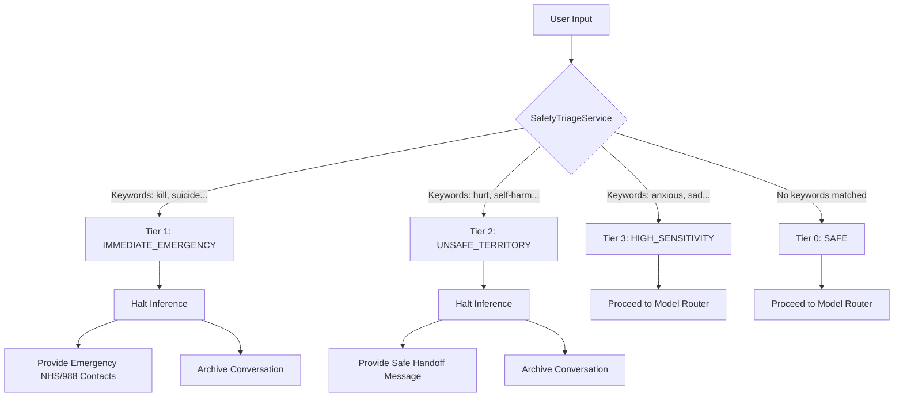

# system-design

## Overview

## Details

## 3-Tier Safety Engine
The application employs a 3-tier safety engine to filter and handle varying levels of distress in user inputs. This logic is managed by `SafetyTriageService`.

### Architecture Diagram

### Safety Tiers Details
1. **Tier 1 — IMMEDIATE_EMERGENCY**: Signifies life-threatening situations. The system halts AI inference completely, archives the conversation for review, and immediately displays a predefined emergency response containing 999/988 and Samaritans contact details.
2. **Tier 2 — UNSAFE_TERRITORY**: Indicates harmful territory but not necessarily immediate life-threatening danger. AI inference is halted, the conversation is archived, and a safe handoff message is shown to the user.
3. **Tier 3 — HIGH_SENSITIVITY**: Indicates sensitive or emotional distress (e.g., anxiety or deep sadness). AI inference is **not** halted. The request is processed, but it signals the model router to select a highly empathetic and supportive AI model.
4. **Tier 0 — SAFE**: Normal conversational tones. The system proceeds with standard tone-based model routing.

## Adaptive Model Routing
In instances where inference proceeds (Tier 0 and Tier 3), user messages are processed by an Adaptive Model Router to select the most therapeutically appropriate HF model.

### Routing Logic
1. **Safety Tier Override**: If the safety engine flags the interaction as **Tier 3 — HIGH_SENSITIVITY**, the system immediately routes the request to an empathetic model (e.g., `Zephyr 7B`) regardless of basic tone scoring.
2. **Tone Analysis Scoring**:
   - `distress` score ≥ 0.5: Routes to `Zephyr 7B` for its highly empathetic tone.
   - `complex` score ≥ 0.33: Routes to `Llama 3 8B Instruct` to handle detailed medical/reasoning tasks.
   - `brief` score ≥ 0.9 (and non-distressed): Routes to `Phi-2` for quick responses.
3. **Default**: Otherwise, requests are routed to `Mistral 7B Instruct` for neutral conversational queries.
